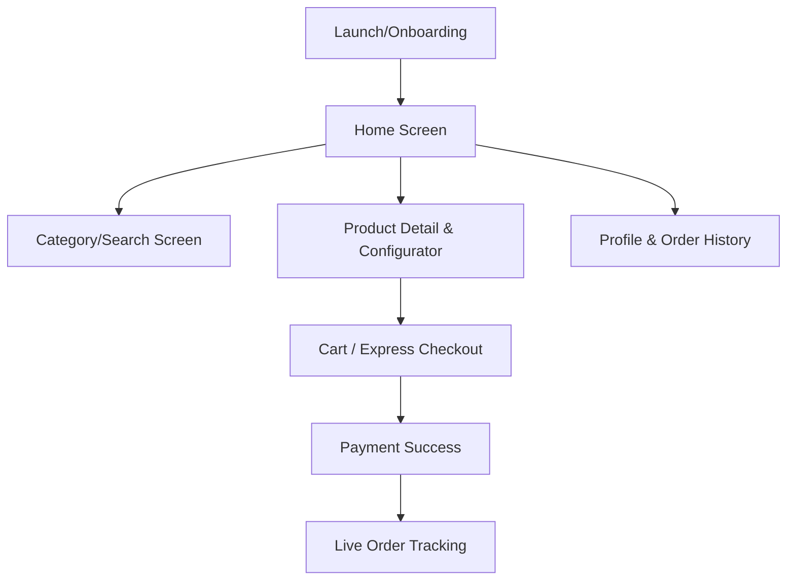
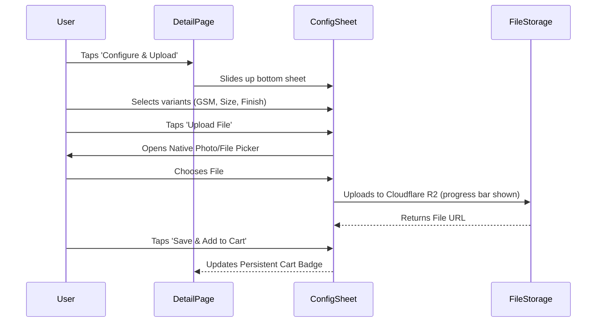

# PrintEve Mobile App UI/UX Architecture & Design Plan

This document outlines the UX/UI planning, Information Architecture (IA), and Design System blueprint for the upcoming **PrintEve Mobile Application** (iOS + Android). 

Our goal is to create a digital-first, premium, and frictionless ordering experience for custom printed products. To achieve this, we have synthesised patterns from industry-leading apps:
- **Zepto**: Sticky, action-oriented Header & Search; rapid categorization.
- **Blinkit**: Sticky persistent cart triggers and express checkout paths.
- **Swiggy Instamart**: Density-optimized visual grids and interactive card state transitions.
- **Uber**: Elegant typography, high-contrast aesthetics, slide-up bottom sheets for options, and high-fidelity live tracking timelines.

---

## User Review Required

We need your validation on these core design decisions before proceeding to the branding and screen layout implementation:

> [!IMPORTANT]
> **1. Target Tech Stack**
> We recommend building the app using **React Native + Expo** with Tailwind CSS (`nativewind`) or a **Progressive Web App (PWA)** matching the Next.js setup. React Native is preferred for native file uploads (max 3GB) and FCM push notifications. Let us know if you agree.

> [!IMPORTANT]
> **2. Authentication Hook**
> The PRD specifies that login is mandatory (no guest checkout). We suggest allowing guest browsing for products and categories (Zepto/Blinkit style), but prompting login when adding to cart, uploading files, or proceeding to checkout to reduce entry friction.

> [!WARNING]
> **3. Design System Scaling**
> We plan to adapt the editorial serif-based branding (Fraunces & DM Sans, dark ink & red accent) from the web application. Serif fonts on mobile require careful size hierarchy to avoid feeling cramped. We will enforce larger display headings and cleaner sans-serif body copy.

---

## Open Questions

Please review these UX edge-cases:
1. **File Upload Limits on Mobile:** The PRD permits up to 3GB files (AI, PDF, CDR). Mobile network connections are often unstable. Should we integrate background file uploading with automatic retry capabilities, or suggest compressing files above 100MB?
2. **Payment Integrations:** Razorpay UPI intent flow is standard on Indian mobile apps (redirecting directly to GPay, PhonePe, Paytm). Should we prioritize a one-click UPI checkout overlay?

---

## 1. Information Architecture (IA)

Below is the structural breakdown of the five primary screens of the PrintEve mobile application:

### 1.1 Home Screen (Zepto-Inspired Layout)
*   **Sticky Top bar:** 
    *   *Left:* Location selector (e.g., "Deliver to: Sector 62, Noida ▾") with delivery time estimates.
    *   *Right:* Profile icon (redirects to Account) & Notification bell.
*   **Omnipresent Search Bar:**
    *   Sticky below the top bar. Supports auto-suggestions and tags (e.g., "Visiting Cards", "Stickers").
*   **Hero Banners Carousel:**
    *   High-contrast, swipeable cards showcasing current promotions or seasonal products (e.g., "Festive Corporate Gifting", "Bulk Stickers 20% Off").
*   **Quick-Access Grid (Instamart Style):**
    *   Vibrant, circular/squircle categories arranged in a 2x4 grid:
        1.  *Visiting Cards*
        2.  *Stickers & Labels*
        3.  *Posters & Banners*
        4.  *Pamphlets & Flyers*
        5.  *Custom Stationery*
        6.  *Badges & Keychains*
        7.  *Packaging Boxes*
        8.  *Explore All Products*
*   **"How it Works" Visual Stepper:**
    *   A simple, horizontal-scrolling card strip: `Choose Product ➔ Upload Design ➔ We Print & Deliver`.
*   **USP Cards & Testimonials:**
    *   Sleek horizontal scroll list promoting: "Verified Printers", "Express Shipping", "No Minimum Order Quality (on select products)".

### 1.2 Search & Listing Screen (Blinkit-Inspired)
*   **Dynamic Search State:** Shows popular searches, recent searches, and auto-completions as the user types.
*   **Split Screen (Category Browse):**
    *   *Left Sidebar:* Vertical category list (Visiting Cards, Flyers, etc.) with icon indicators.
    *   *Right Content Area:* Grid of product cards.
*   **Product Card Design:**
    *   Product image preview with aspect ratio optimized for mobile (1:1).
    *   Product name, base price (e.g., "Starting at ₹299").
    *   "Add" Button: Pressing "Add" reveals a quick-select variant dropdown or triggers the configurator sheet.

### 1.3 Product Detail & Configurator (Uber-Inspired Bottom Sheet)
To keep the UI clean, we divide this into a primary view and a secondary configuration sheet:
*   **Primary Detail Screen:**
    *   **Hero Gallery:** High-res image carousel (3:2 ratio) with pinch-to-zoom support.
    *   **Info Stack:** Bold serif title, review rating badge, and expandable description accordion listing material types.
    *   **Persistent Bottom Action Bar:** Displays total price dynamically, and a main call-to-action button: `Configure & Upload`.
*   **Slide-up Configurator Sheet:**
    *   When the user taps `Configure & Upload`, an Uber-style bottom sheet slides up covering 85% of the screen.
    *   **File Dropzone:** Tap to select from device storage, Google Drive, or capture directly from the camera. Displays uploading progress bar.
    *   **Options Grid:** Segmented control tabs or dropdown select boxes for Paper Size, Finish, GSM Quality, and Single/Double Sided.
    *   **Quantity Stepper:** Stepper button `[- 100 +]` flanked by quick-select tier cards (e.g., "100 pcs - 5% Off", "500 pcs - 15% Off").
    *   **CTA:** `Save & Add to Cart` (dismisses sheet, updates persistent cart bar).

### 1.4 Cart & Checkout (Frictionless Speed)
*   **Sticky Cart Bar (Persistent):**
    *   Flashing bottom bar visible on Home and Catalog screens when items are in cart: `[🛒 2 Items | ₹1,250] ➔ View Cart [Chevron]`.
*   **Cart Review:**
    *   Displays individual product cards with configuration summaries, custom file name badges, and edit/delete icons.
    *   Delivery address picker card (tap to change).
*   **Price Summary:**
    *   Item total, GST, shipping fees, and coupon discount code input.
*   **Slide-to-Pay (Swipe action):**
    *   A premium, green slide-to-pay gesture to trigger Razorpay checkout instantly.

### 1.5 Order Status & Live Tracking (Uber & Swiggy Tracker)
*   **State-driven Progress Timeline:**
    *   Visual progress timeline with elegant status icons and progress bars:
        *   `● Order Confirmed` (Green check)
        *   `● Assigned to Print Partner` (Printer icon + status)
        *   `● In Production` (Animated printer head icon)
        *   `● Quality Checked` (Verified badge)
        *   `● Dispatched` (Courier truck animation)
        *   `● Delivered` (Package open)
*   **Print Proof Preview:**
    *   Once the printer completes the job, they upload a completion photo. The app displays this proof image inside a mini modal for user assurance.

---

## 2. Design System / Visual Tokens

To maintain consistency with the web design but optimize for high-end mobile screens:

### 2.1 Colors
*   **Backgrounds:** Sleek Light mode (`#FCFAF7` Warm Paper) and Premium Dark mode (`#121212` Ink-Black).
*   **Text:** Primary Ink (`#1A1A1A`), Secondary Muted (`#6B7280`).
*   **Accents:** Editorial Red (`#D9383A` - used sparingly for primary CTAs and status highlights) and Success Green (`#10B981` - for confirmed payments and delivery statuses).
*   **Borders:** Soft Paper Gray (`#E5E7EB`).

### 2.2 Typography
*   **Headings (Serif):** *Fraunces* or standard system Serif (e.g., Georgia). High visual character. Used for headers, titles, and price totals.
*   **Body & UI (Sans):** *DM Sans* or standard system Sans (e.g., SF Pro / Roboto). Highly legible, even at small sizes (10pt-14pt).

### 2.3 Radius & Spacing
*   **Radius:** Soft, premium squircle corners (`12px` for product cards, `16px` for bottom sheets).
*   **Gutter Spacing:** `16px` grid system.

---

## 3. Key Interactive Components

| Component | Visual Behavior | Interaction Mechanics |
| :--- | :--- | :--- |
| **`ConfiguratorSheet`** | Slides up from bottom. Dimmed background overlay. | Pull down to close, or tap X. |
| **`UploadDropzone`** | Dashed red/gray box with cloud icon. | Tap triggers native file/photo picker. Displays dynamic file details. |
| **`TierQuantitySelector`**| Row of three card blocks. | Tapping a card automatically updates the stepper value. |
| **`SlideToPayButton`** | Horizontal slider bar. | Drag circle from left to right; triggers haptic vibration on success. |
| **`StatusTimeline`** | Vertically stacked dots connected by animated lines. | Dots pulse based on the active state. |

---

## 4. User Flow Layouts

### 4.1 Product Configuration & File Upload Flow

---

## Verification Plan

### Manual Verification
1.  **Bottom Sheet Interactions:** Test the smooth sliding animation of the Configurator sheet. Verify it closes gracefully when dragged down.
2.  **File Upload Progress:** Validate that the upload progress indicator updates incrementally when selecting files from mobile storage.
3.  **Sticky Cart Bar Responsive Height:** Ensure the sticky cart bar doesn't overlay key navigational elements at the bottom of the screens.
4.  **Razorpay Webhook Verification:** Simulate Razorpay UPI payment success and ensure the order state immediately switches to `CONFIRMED` on the status tracker screen.
